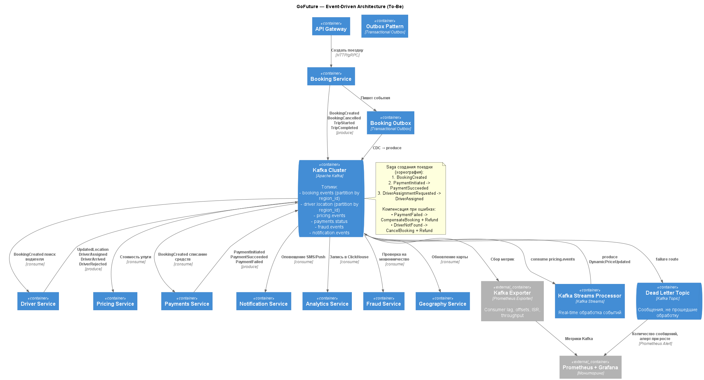

## Доменные события и схема топиков Kafka

### В архитектуре выделены следующие ключевые доменные события:

|    Домен     |                                События                                 |
| :----------: | :--------------------------------------------------------------------: |
|   Booking    | BookingCreate, BookingCanseled, BookingTripStart, BookingTripCompleted |
|    Driver    |  DriverLocationUpdated, DriverAssigned, DriverArrived, DriverRejected  |
|   Payments   |           PaymentInitialated, PaymentSuccesed, PaymentFailed           |
|   Pricing    |                  PricingRequered, PricingPriceUpdated                  |
|    Fraud     |                   FraudRequered, FraudCheckCompleted                   |
| Notification |                 NotificationRequered, NotificationSent                 |

## Схема топиков Kafka 

### Основные топики и ключи партиционирования:
booking.events
  - key: region_id
  - partitions: 128 (средняя частота обновлений)
  - replication: 3
  - retention: 7 days

driver.location
  - key: region_id
  - partitions: 256 (высокая частота обновлений, водители шлют координаты каждые несколько секунд)
  - replication: 3

pricing.events
  - key: booking_id
  - partitions: 64

payments.status
  - key: booking_id
  - partitions: 64

fraud.events
  - key: payment_id
  - partitions: 32

notification.events
  - key: user_id
  - partitions: 32

Почему partition key = region_id
- Для GoFuture критично геораспределение нагрузки:
- поездки всегда относятся к регионам
- расчёт цены зависит от регионального спроса
- сами водители физически находятся в регионах

Так обеспечивается масштабирование по географическим зонам, а не по всей мировой нагрузке.

## Обработка в реальном времени (real-time)

### Pricing Stream Processor (Kafka Streams)
Для расчета динамической цены в реальном времени

**Обрабатывает**
- booking.event
- drive.location
**Выдает**:
- DynamicPriceUpdated -> pricing.events
**Почему Kafka Streams**
- Полная совместимость с Apache Kafka
- Поддержка CDC
- Работает внутри микросервисов
- Надежная доставка сообщений
- Stateful и stateless обработка данных

### Надежная доставка
1. Outbox Pattern (Transactional Outbox)
   - Гарантия, что событие не потеряется при записи в БД:
     - Booking Service пишет в локальную транзакционную таблицу events_outbox
     - CDC-процесс (Debezium) читает изменения
     - публикует события в Kafka
2. DLT — Dead Letter Topic
    - Сюда попадают сообщения, которые:
      - были повреждены
      - вызвали ошибку бизнес-логики
      - не прошли idempotency check
      - превышают лимит ретраев
    - Используется для:
      - алертинга
      - анализа ошибок
      - ретрай-процессов
      - отложенной обработки
3. Idempotency & Retries
   - Каждый консьюмер использует:
     - idempotency-key = event_id
     - retry strategy: exponential backoff
     - max retries = 5
     - fallback -> DLT
  
## Saga (хореография) для создания поездки

Выбрана Choreography Saga, т.к.:
   - система высоконагруженная 
   - распределенная
   - отсутствие единой точки отказа
   - модульность 
   - быстрое маштабирование
  
**Последовательность:**
1. Booking Service -> BookingCreated
2. Payments Service -> PaymentInitiated
3. Payments Service -> PaymentSucceeded
4. Driver Service -> DriverAssignmentRequested
5. Driver Service -> DriverAssigned

**Компенсация:**
- PaymentFailed → Refund + CancelBooking
- DriverNotFound → Refund + CancelBooking
  
Координация происходит через события.

## Мониторинг событийной платформы

- Prometheus — сбор метрик
- Grafana — визуализация
- Kafka Exporter — метрики брокеров
- Alertmanager — автоматические алерты

## Метрики, которые собираются

### Метрики Kafka Broker
- Входящий и исходящий трафик
- Количество активных соединений
- Использование ресурсов
- Количество активных брокеров
- Количество сообщений
  
### Метрики Consumer Lag
- Задержка между производством сообщений в топиках Kafka и их потреблением (`kafka_consumergroup_lag`)
- Максимальное запаздывание по смещениям для групп (`kafka_consumergroup_max_lag`)

### Метрики событий
- Задержки в обработке
- Частота стобев
- Количество повторяемых попыток

### Метрики Stream Processors
- Размер хранилища состояний
- Сбои
  
### Инструменты мониторинга
  
|   Инструмент   |             Использование              |
| :------------: | :------------------------------------: |
|   Prometheus   |            сбор всех метрик            |
|    Grafana     | дашборды по Kafka, lag, pricing, fraud |
| Kafka Exporter |                  lag                   |
|  Alertmanager  |             алерты по SLA              |
|      Loki      |              логи событий              |

**Причины выбора**
1. Prometheus: 
   - Горизонтальное масштабирование
   - Эффективное хранение
   - Низкие требования к мощностям
   - Богатая экосистема
   - Простой API
   - Интеграция с Grafana
   - Поддержка Alertmanager
2. Grafana:
   - Гибкость и расширяемость
   - Разнообразные типы графиков и диаграмм
   - Низкие требования к мощностям
   - Масштабируемость при росте нагрузки
   - Интеграция с Prometheus

## Обоснование выбора подходов

1. Почему Kafka:
    - Распределённая архитектура
    - Грантии доставки
    - Масштабирование по регионам
    - Поддержка real-time обработки
    - Высокая пропускная способность
    - Эффективно работает с большими потоками данных
    - Многопоточная обработка
    - Open-source решение
    - Большое community
2. Почему Outbox:
    - Надёжная доставка
    - Consistency между БД и Kafka
3. Почему Saga (хореография):
    - Низкая задержка
    - Быстрое маштабирование
    - Децентрализация управления процессами
    - Нет сложных ветвлений
4. Почему Streaming Processors:
    - необходимость real-time динамического ценообразования
    - антифрод в режиме реального времени
    - кэширование региональных агрегатов

## Диаграмма 
[Код диаграммы](ToBe_EventDriven_C2.puml)
