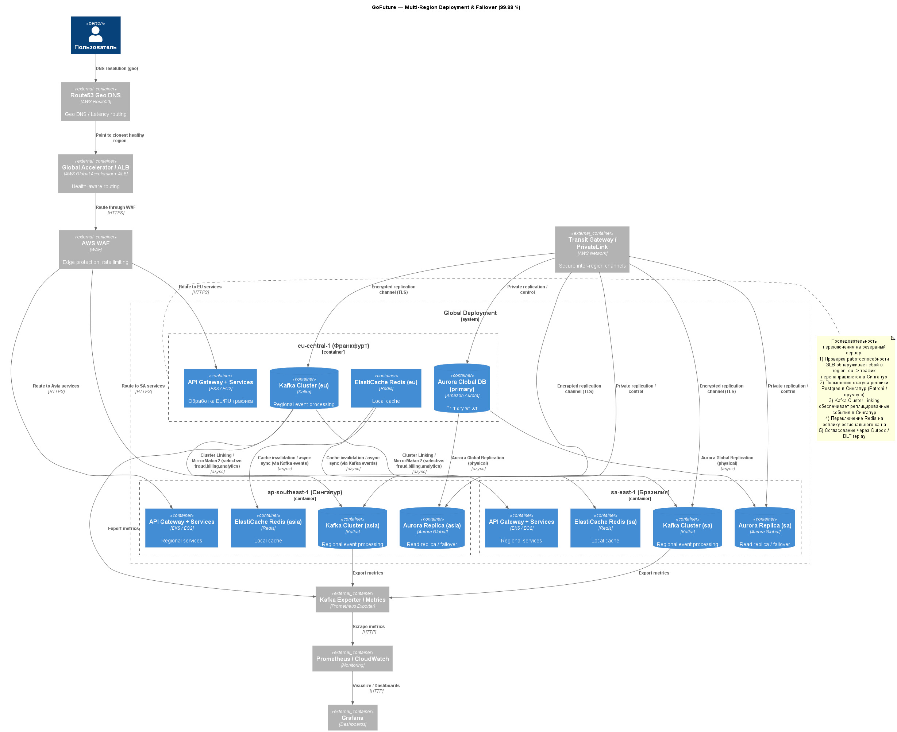

# Обеспечить высокую нагрузку

## Выбор регионов
Переход на другого облачного провайдера AWS - чтобы был единый облачный провайдер (AWS) для всех регионов с централизованным управлением и консистентной архитектурой.

Выбраны 3 региона для AWS:
1. Франкфурт eu-central (AWS) - как основного хаб-региона для обслуживания российского и европейского трафика.
   - Средняя latency Москва-Франкфурт составляет 30-50ms, что приемлемо для большинства сценариев использования такси-сервиса
   - AWS Frankfurt является одним из крупнейших и наиболее стабильных регионов в Европе
   - Регион полностью соответствует GDPR и другим европейским регуляторным требованиям
   - При необходимости можно использовать AWS Direct Connect через партнёров в Москве для улучшения latency
2. Сингапур ap-southeast-1 (AWS):
   - Обслуживает Юго-Восточную Азию
   - Причины выбора:
     - Крупнейший хаб AWS в Азии
     - Оптимальная геолокация - центральное расположение для региона ЮВА
     - Современные дата-центры Tier III+
     - Благоприятное законодательство для IT-бизнеса
3. Бразилия sa-east-1 (AWS) (pt).
   - Обслуживает Южную Америку:
     - Единственный регион AWS в Южной Америке
     - Охватывает крупнейшие рынки: Бразилия, Аргентина, Чили
     - Локализация для соответствия LGPD

## Архитектурные принципы
- Regional-first: каждый регион обслуживает локальных пользователей, используя локальные кэши и сервисы.
- Selective replication: реплицируются только глобально-консолидационные топики и данные.
- Минимизация межрегионального трафика через partitioning и локализацию топиков.
- Защищённые межрегиональные каналы (AWS PrivateLink / VPN / Transit Gateway).
- Централизованный мониторинг и alerting (Prometheus/Grafana или Managed CloudWatch + Grafana).

## Схема репликации
### Kafka — георепликация событий
**Архитектура**: Независимые Kafka-кластеры в каждом регионе с избирательной репликацией.
**Репликация**: использовать Cluster Linking (Confluent) или MirrorMaker2 как fallback.
**Стратегия**: 
Selective Replication по типам топиков:
- Глобально реплицируемые (через MirrorMaker2):
    - fraud.events — для централизованного антифрода
    - billing.events — для консолидированного биллинга
    - analytics.events — для глобальной аналитики
- Локальные топики (остаются в регионе)
    - driver.location.{region} — партиционировано по region_id
    - notification.events.{region} — региональные уведомления
    - booking.events.{region} — локальные бронирования

### PostgreSQL — Amazon Aurora Global Database
- **Выбор:** Amazon Aurora Global DB (primary в `eu-central-1`, вторичные реплики в `ap-southeast-1` и `sa-east-1`)
 **Причины:** низкая репликационная задержка, встроенные механизмы failover и ручное/автоматическое промоутирование региональных реплик.
- **План failover:** promote regional secondary -> переключение записи -> синхронизация сервисов.
- 
### Redis / Caching
- Per-region Redis (Amazon ElastiCache) — локальный hot-cache.
- Асинхронная репликация/invalidations через Kafka events.
- Hot data: Для минимизации задержек храните данные в локальном Redis.
 
---

## Geo-routing и Global Load Balancer
**Flow:**
1. Пользователь -> DNS (Geo DNS) -> Global Load Balancer
2. GLB делает health check в региональных endpoints и маршрутизирует по latency/geo
3. Трафик проходит через WAF -> API Gateway в регионе
**Health checks:**
1. HTTP health-checks для сервисов
2. TCP/port checks для infra

## Таблица отказов

|      Сценарий отказа      |            Описание             |             Последствия             |            Действия по восстановлению            |                                                            Метрики для мониторинга                                                            |
| :-----------------------: | :-----------------------------: | :---------------------------------: | :----------------------------------------------: | :-------------------------------------------------------------------------------------------------------------------------------------------: |
|       Отказ региона       |     Выход из строя сервера      |      Потеря доступа в регионе       | Автоматическое переключение на резервыне регионы |                                                  TCP-порт недоступен , health проверка fail,                                                  |
|        Сбой Kafka         |     Отказ брокера сообщений     | Накопление неотправленных сообщений | Автоматическое переключение на резервные брокеры |                          Недостаточно in-sync реплик (ISR), журналы логов не доступны, Disk space < 10%, CPU (>80%)                           |
|     Отказ базы данных     |         Сбой основой БД         | Потеря записи/чтения данных читать  |         Переключение на резервную копию          | TCP health-check == Error, Status == stop, sum(pg_stat_activity_count) >= 0.95 * max_connections, висящие запросы > 5 мин, Disk space < 10 гб |
|     Сетевая изоляция      |  Потеря связи между регионами   |  Разрыв транзакций между регионов   |             Востановления соединения             |                                                     HTTP health-check >= 500 or time-out                                                      |
|    Перегрузка системы     | Превышение допустимой нагрузки  |    Зависание запросов, тайм-ауты    |          Автоскейлинг, Дросселирование           |                                                    CPU > 80%, Memory > 80%, RPS > 100 тыс                                                     |
|     Сбой микросервиса     |    Отказ отдельного сервиса     |       Нарушение бизнес-логики       |       Перезапуск контейнера, откат версии        |                             HTTP health-check >= 500 or time-out, CPU > 80%, P99 latency > порог, status == stop                              |
|         DoS-атака         |  Перегрузка системы запросами   |        Отказ в обслуживании         |         WAF-фильтрация, ограничение RPS          |                                                           Высокий уровень запросов                                                            |
|   Сбой платежного шлюза   | Отказ внешнего сервиса платежей |        Невозможность оплаты         |         Переключение на резервную копию          |              HTTP-status >= 500 or time-out, P95/P99 latency > 10 сек, много событий PaymentFailed и близко к 0 PaymentSuccesed               |
| Отказ системы уведомлений |   Сбой в отправке уведомлений   |      Негатив от пользователей       |   Буферизация уведомлений, повторная отправка    |                                                             Ошибка отправки > 1%                                                              |
				
## Безопасность и сеть
- AWS WAF + AWS Shield (edge DDoS protection)
- AWS Transit Gateway / PrivateLink / VPN для межрегиональной репликации  
- VPC segmentation, DMZ, app subnet, data subnet
- IAM — least privilege, service accounts, key rotation
- Audit & Logging — centralized logging (Loki/ELK) с хранением данных и alerting                

## Monitoring и алёртинг
- **Основной стек (вариант A):** Prometheus + Grafana + Alertmanager  
- **Kafka metrics:** Kafka Exporter / Confluent metrics - > Prometheus / CloudWatch metrics  
- **DB metrics:** Aurora CloudWatch metrics, replication lag  
- **Ключевые алерты:** consumer lag, replication lag, broker disk, DB connections, P99 latency, error rate

## Диаграммма

[Код диаграммы](C4.puml)
