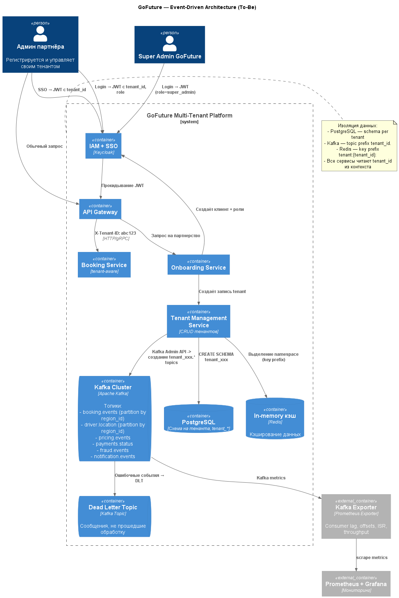

# Архитектура многопользовательской платформы

## **Архитектура Multi-Tenant Platform**

Сервисы и хранилища:
- SSO (Keycloak) — аутентификация и авторизация, выдача JWT
- API Gateway — прокси, проверка подписи JWT
- Tenant Management Service — создание тенантов (БД, Kafka, Redis)
- Onboarding Service — заявки партнёров
- PostgreSQL (schema-per-tenant)
- Kafka (topic prefix per tenant)
- Redis (tenant key prefix)
- Monitoring: Prometheus + Grafana + Kafka Exporter

## **Таблица ролей (RBAC модель)**

| Роль                    | Описание                                                                                         | Чтение данных            | Изменение данных          | Уровень доступа | Доступные сущности                                                                           |
| ----------------------- | ------------------------------------------------------------------------------------------------ | ------------------------ | ------------------------- | --------------- | -------------------------------------------------------------------------------------------- |
| **Супер админ**         | Полный доступ к системе. Управление всеми пользователями, партнёрами, водителями, конфигурацией. | да                       | да                        | полный          | Все сущности (включая PII)                                                                   |
| **Админ партнёра**      | Управляет водителями и заказами своего партнёра.                                                 | да                       | да                        | частичный       | Водители, заказы, платежи — только своего партнёра                                           |
| **Менеджер приложения** | Управляет заявками на партнёрство: просмотр/одобрение/отклонение.                                | да                       | да (только статус заявки) | ограниченный    | Заявки партнёров                                                                             |
| **Партнёр**             | Управляет собственным профилем, подаёт заявку на партнёрство.                                    | да (только свой профиль) | да (только свой профиль)  | ограниченный    | Профиль партнёра                                                                             |
| **Пользователь**        | Заказывает поездки, видит историю заказов, оценивает водителя.                                   | да (только свои данные)  | да (оценка водителя)      | ограниченный    | Свои заказы, общая информация о водителе (PII скрыты)                                        |
| **Водитель**            | Выполняет заказы, видит минимальную информацию о пассажире.                                      | да (только свои заказы)  | нет                       | ограниченный    | Свои заказы, общая информация о пассажире (PII скрыты)                                       |
| **Аналитик**            | Доступ к отчётам и агрегированным данным. Анализ метрик.                                         | да                       | нет                       | ограниченный    | Деперсонализированные данные о заказах, финансовые метрики                                   |
| **Техподдержка**        | Помогает пользователям и водителям. Просматривает логи, может начислить бонусы.                  | да                       | да (только скидки/бонусы) | частичный       | Заказы, логи, профиль пользователя (частично), водитель (частично). Все действия логируются. |

## **Модель изоляции данных**

**PostgreSQL**
Schema per tenant:
- tenant_123.users
- tenant_123.orders
- tenant_456.orders

Изоляция достигается на уровне схем.

**Kafka**
Каждый тенант получает свой набор топиков:
- tenant123.booking.events
- tenant123.payments.events
- tenant456.booking.events

**Redis**
Используется каскадный префикс: 
- tenant:123:order:555
- tenant:123:session:abc

## Процесс автоматического онбординга нового партнёра (< 1 час)

1. Партнёр регистрируется через SSO-портал -> получает роль Partner
2. Заполняет форму в корпоративном портале -> создаётся заявка
3. Onboarding Service (после одобрения SuperAdmin):
   - генерирует `tenant_id`
   - создаёт схему `tenant_abc123` в PostgreSQL
   - создаёт топики `tenant_abc123.*` через Kafka Admin API
   - настраивает key prefix в Redis
   - создаёт Realm/Client + роли в Keycloak
4. Партнёр получает письмо с доступом -> сразу может пользоваться платформой
5. Всё логируется, мониторится, откат - удаление схемы + топиков

## Диаграмма

[Код диаграммы](MultiTenant_Architecture.puml)
